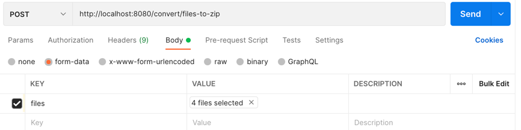

# Export bulk files to zip
This program will allow you to upload single or a list of files and export them to zip.

To run this program using docker you will need these steps :
- Download docker for your machine https://docs.docker.com/get-docker/
- Run docker and import our application docker image
- Run command docker run -p 8080:8080 springio/file-export-spring-boot-docker  (springio/file-export-spring-boot-docker name of the image)

Now you can try to hit the Api by using a call similar to this:
Using a Platform API :
  -Select POST method and use this uri http://localhost:8080/convert/files-to-zip
  -under body add files to zip : see image below

Or alternatively use this curl code
curl --location --request POST 'http://localhost:8080/convert/files-to-zip' \
--form 'files=@"YOUR_FILE_LOCATION1"' \
--form 'files=@"YOUR_FILE_LOCATION2"'

If you have trouble running the image, try cloning the project and then follow below instructions

Steps to create docker image
- 1- create jar file using command:
./mvnw package && java -jar target/file-export-spring-boot-docker-0.1.0.jar
- 2- build docker image with command 
docker build -t springio/file-export-spring-boot-docker .

Now you can try exporting some files to zip;

